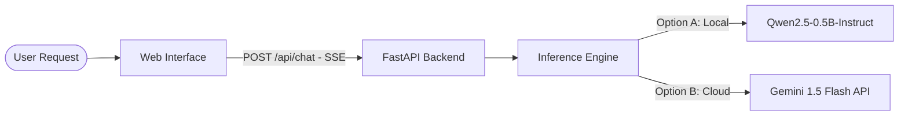

# OS Reply Engine

An AI-powered Operating Systems tutor and Q&A engine. This system provides a web-based chat interface delivering real-time, streaming explanations of core Operating Systems concepts (processes, scheduling, memory management, deadlocks, and file systems).

---

## 🚀 Key Features

* **Dual-Inference Engine**:
  * **Local LLM**: Low-latency execution of `Qwen2.5-0.5B-Instruct` (~494M parameters) using PyTorch, optimized for CPU, Apple Silicon (MPS), and CUDA.
  * **Cloud Fallback**: Serverless execution via the Google Gemini 1.5 Flash API.
* **Real-time SSE Streaming**: Server-Sent Events (SSE) stream answers token-by-token directly to the client.
* **Modern Web Interface**: Premium dark-mode responsive UI built with vanilla glassmorphism CSS, customized markdown rendering, and animated typing indicators.
* **Containerized Deployment**: Ready-to-deploy Docker and Docker Compose configurations.

---

## 🏗️ System Architecture



---

## 🛠️ Setup & Installation

### Prerequisites
* Python 3.11+
* Git

### 1. Clone & Environment Setup
```bash
git clone <repository-url>
cd os-reply-engine

# Initialize virtual environment
python -m venv venv
source venv/bin/activate  # On Windows: venv\Scripts\activate

# Upgrade pip and install dependencies
pip install --upgrade pip
pip install -r requirements.txt
```

### 2. Configure Environment Variables (Optional)
To use the Gemini API instead of the local model, set the following environment variable:
```bash
export GEMINI_API_KEY="your_api_key_here"
```

---

## 💻 Running the Application

Start the FastAPI application server:
```bash
PYTHONPATH=. ./venv/bin/python server/main.py
```

* **Local LLM Mode**: If `GEMINI_API_KEY` is not set, the server will automatically download `Qwen2.5-0.5B-Instruct` (~950MB) on first run and run inference locally on your hardware (CPU, MPS, or CUDA).
* **Cloud Mode**: If `GEMINI_API_KEY` is detected, the server routes all queries directly to Google Gemini for ultra-low latency response times.

Access the chatbot web interface in your browser:
👉 **http://localhost:8000**

---

## 🔌 API Documentation

### 1. Health Status
* **Endpoint**: `GET /api/health`
* **Response**:
```json
{
  "status": "healthy",
  "model_loaded": true,
  "model_params": 494032768,
  "device": "mps"
}
```

### 2. Chat Streaming (SSE)
* **Endpoint**: `POST /api/chat`
* **Request Body**:
```json
{
  "question": "Explain virtual memory paging.",
  "temperature": 0.7,
  "max_tokens": 300
}
```
* **Response**: Stream of Server-Sent Events yielding token chunks.

---

## 📁 Project Structure

```
os-reply-engine/
├── server/
│   ├── main.py            # FastAPI application routes and server setup
│   ├── inference.py       # Decoupled Inference Engine (Qwen / Gemini)
│   └── requirements.txt   # Backend-specific package list
├── frontend/
│   ├── index.html         # Responsive web interface layout
│   ├── style.css          # Design system and layout (glassmorphism UI)
│   └── script.js          # Event handlers and SSE stream rendering
├── requirements.txt       # Unified project dependencies
├── Dockerfile             # Container configuration
└── docker-compose.yml     # Multi-container orchestration config
```

---

## 🐳 Docker Deployment

To build and run the application inside a container:

```bash
docker-compose up --build
```
The application will be accessible at `http://localhost:8000`.

---

## 📄 License
This project is open-source and available under the MIT License.
